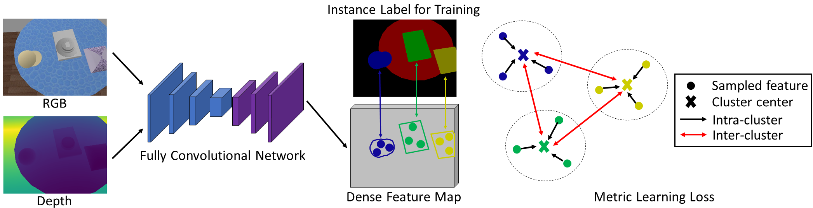
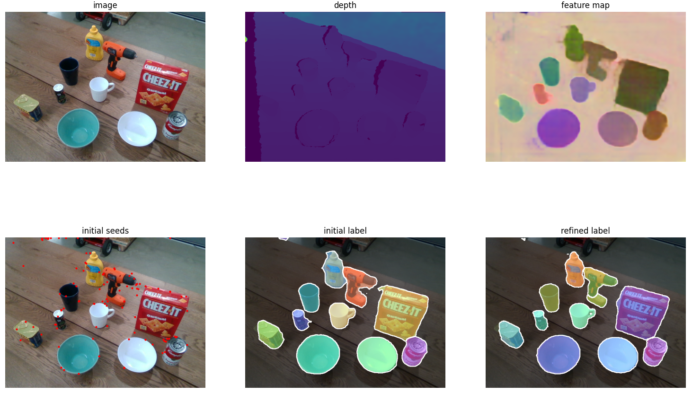
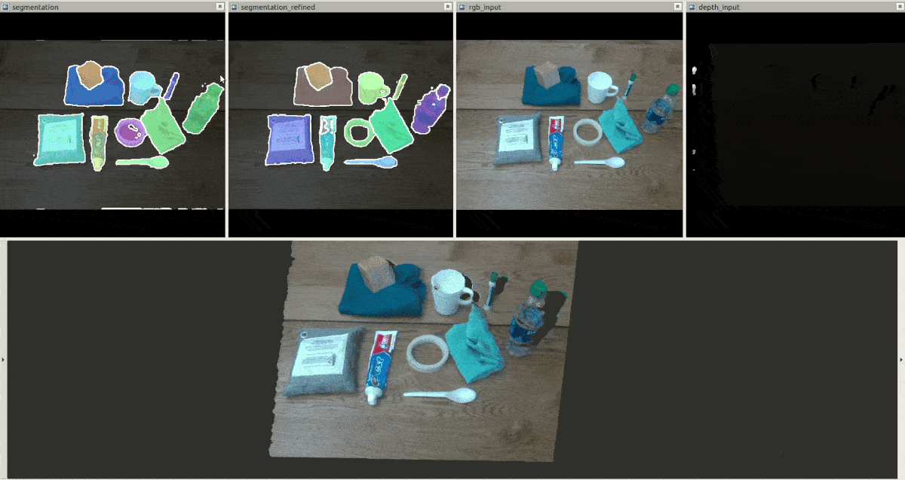

# Unseen Object Clustering: Learning RGB-D Feature Embeddings for Unseen Object Instance Segmentation

### Introduction

In this work, we propose a new method for unseen object instance segmentation by learning RGB-D feature embeddings from synthetic data. A metric learning loss functionis utilized to learn to produce pixel-wise feature embeddings such that pixels from the same object are close to each other and pixels from different objects are separated in the embedding space. With the learned feature embeddings, a mean shift clustering algorithm can be applied to discover and segment unseen objects. We further improve the segmentation accuracy with a new two-stage clustering algorithm. Our method demonstrates that non-photorealistic synthetic RGB and depth images can be used to learn feature embeddings that transfer well to real-world images for unseen object instance segmentation. [arXiv](https://arxiv.org/pdf/2007.15157.pdf), [Talk video](https://youtu.be/pxma-x0BGpU)

<p align="center"></p>

### License

Unseen Object Clustering is released under the NVIDIA Source Code License (refer to the LICENSE file for details).

### Citation

If you find Unseen Object Clustering useful in your research, please consider citing:

    @inproceedings{xiang2020learning,
        Author = {Yu Xiang and Christopher Xie and Arsalan Mousavian and Dieter Fox},
        Title = {Learning RGB-D Feature Embeddings for Unseen Object Instance Segmentation},
        booktitle = {Conference on Robot Learning (CoRL)},
        Year = {2020}
    }


### Required environment

- Ubuntu 16.04 or above
- PyTorch 0.4.1 or above
- CUDA 9.1 or above


### Installation

1. Install [PyTorch](https://pytorch.org/).

2. Install python packages
   ```Shell
   pip install -r requirement.txt
   ```


### Download

- Download our trained checkpoints from [here](https://utdallas.box.com/s/9vt68miar920hf36egeybfflzvt8c676), save to $ROOT/data.


### Running the demo

1. Download our trained checkpoints first.

2. Run the following script for testing on images under $ROOT/data/demo.
    ```Shell
    ./experiments/scripts/demo_rgbd_add.sh
    ```

<p align="center"></p>


### Training and testing on the Tabletop Object Dataset (TOD)
1. Download the Tabletop Object Dataset (TOD) from [here](https://drive.google.com/uc?export=download&id=1Du309Ye8J7v2c4fFGuyPGjf-C3-623vw) (34G).

2. Create a symlink for the TOD dataset
    ```Shell
    cd $ROOT/data
    ln -s $TOD_DATA tabletop
    ```

3. Training and testing on the TOD dataset
    ```Shell
    cd $ROOT

    # multi-gpu training, we used 4 GPUs
    ./experiments/scripts/seg_resnet34_8s_embedding_cosine_rgbd_add_train_tabletop.sh

    # testing, $GPU_ID can be 0, 1, etc.
    ./experiments/scripts/seg_resnet34_8s_embedding_cosine_rgbd_add_test_tabletop.sh $GPU_ID $EPOCH

    ```


### Testing on the OCID dataset and the OSD dataset

1. Download the OCID dataset from [here](https://www.acin.tuwien.ac.at/en/vision-for-robotics/software-tools/object-clutter-indoor-dataset/), and create a symbol link:
    ```Shell
    cd $ROOT/data
    ln -s $OCID_dataset OCID
    ```

2. Download the OSD dataset from [here](https://www.acin.tuwien.ac.at/en/vision-for-robotics/software-tools/osd/), and create a symbol link:
    ```Shell
    cd $ROOT/data
    ln -s $OSD_dataset OSD
    ```

3. Check scripts in experiments/scripts with name test_ocid or test_ocd. Make sure the path of the trained checkpoints exist.
    ```Shell
    experiments/scripts/seg_resnet34_8s_embedding_cosine_rgbd_add_test_ocid.sh
    experiments/scripts/seg_resnet34_8s_embedding_cosine_rgbd_add_test_osd.sh

    ```

### Running with ROS on a Realsense camera for real-world unseen object instance segmentation

- Python2 is needed for ROS.

- Make sure our pretrained checkpoints are downloaded.

    ```Shell
    # start realsense
    roslaunch realsense2_camera rs_aligned_depth.launch tf_prefix:=measured/camera

    # start rviz
    rosrun rviz rviz -d ./ros/segmentation.rviz

    # run segmentation, $GPU_ID can be 0, 1, etc.
    ./experiments/scripts/ros_seg_rgbd_add_test_segmentation_realsense.sh $GPU_ID
    ```

Our example:
<p align="center"></p>
